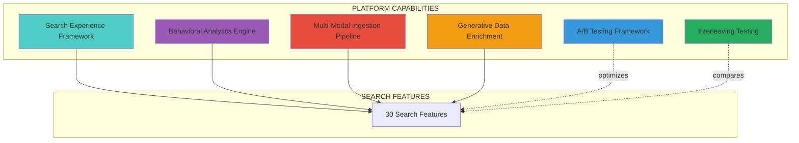

import PlatformCapabilities from '../components/PlatformCapabilities'

# Platform Capabilities

**6 foundational components** that power the search platform — the infrastructure behind all features.

## Features vs Capabilities

| Aspect | Search Features | Platform Capabilities |
|--------|----------------|----------------------|
| **User** | Buyers interact directly | Internal/technical teams |
| **Visibility** | Customer-facing | Behind the scenes |
| **Examples** | Auto Complete, Semantic Search | Analytics Engine, Ingestion Pipeline |
| **Evaluation** | Feature-by-feature scoping | Included in platform |

## The 6 Platform Capabilities

<PlatformCapabilities />

## How Capabilities Power Features

## Capability Dependencies

| Capability | Enables These Features |
|------------|----------------------|
| **Search Experience Framework** | All UI-facing features (Auto Complete, Faceted Search, Visual Filters) |
| **Behavioral Analytics Engine** | Trending Search, Related Searches, ML Ranking, Personalization |
| **Multi-Modal Ingestion Pipeline** | Universal Search, Image Search, Document Search |
| **Generative Data Enrichment** | Semantic Search (via rich descriptions), AI Enrichment Dashboard |
| **A/B Testing Framework** | Analytics, Curations optimization, Ranking improvements |
| **Interleaving Testing** | ML Ranking comparisons, Algorithm optimization |

## When to Discuss Capabilities

Capabilities typically come up in:

1. **Technical Architecture Reviews** — Understanding the platform foundation
2. **Data Integration Planning** — How to connect existing systems
3. **Optimization Discussions** — How to measure and improve search
4. **Enterprise Evaluations** — Security, scalability, and compliance requirements

For client-facing feature discussions, focus on the [30 Search Features](/features) instead.
